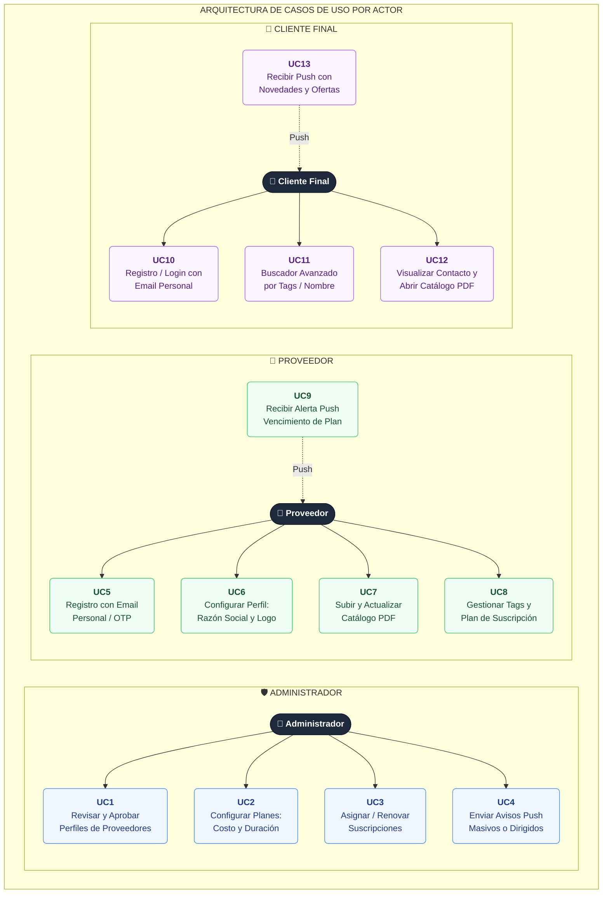
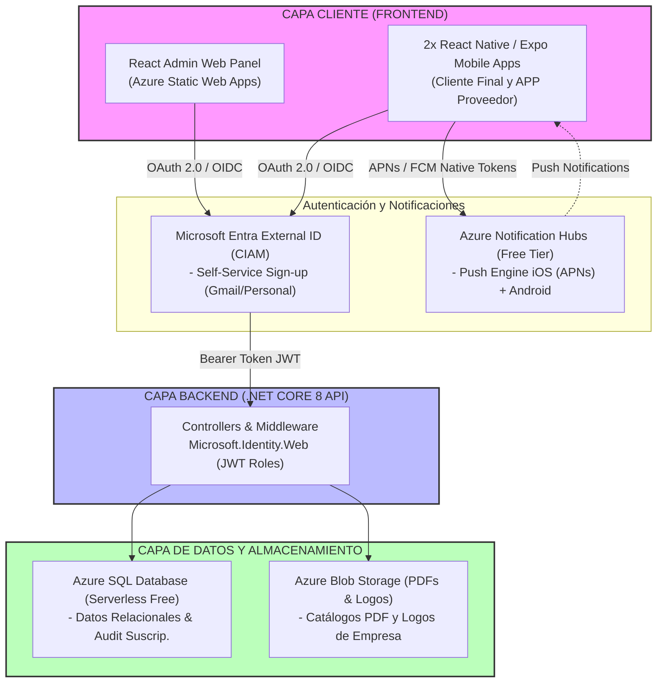

# DistroYaApiBackend
DistroYaApiBackend
# Caso de Usos

```mermaid
flowchart TD
    %% Definición de Estilos
    classDef actor fill:#1e293b,stroke:#0f172a,color:#ffffff,font-weight:bold,rx:8,ry:8
    classDef adminUC fill:#eff6ff,stroke:#3b82f6,color:#1e3a8a,rx:6,ry:6
    classDef provUC fill:#f0fdf4,stroke:#22c55e,color:#14532d,rx:6,ry:6
    classDef cliUC fill:#faf5ff,stroke:#a855f7,color:#581c87,rx:6,ry:6

    subgraph Actores_Global ["ARQUITECTURA DE CASOS DE USO POR ACTOR"]
        direction LR

        %% ==========================================
        %% 1. ADMINISTRADOR
        subgraph Col_Admin ["🛡️ ADMINISTRADOR"]
            direction TB
            Admin(["👤 Administrador"]):::actor
            
            UC1["<b>UC1</b><br/>Revisar y Aprobar<br/>Perfiles de Proveedores"]:::adminUC
            UC2["<b>UC2</b><br/>Configurar Planes:<br/>Costo y Duración"]:::adminUC
            UC3["<b>UC3</b><br/>Asignar / Renovar<br/>Suscripciones"]:::adminUC
            UC4["<b>UC4</b><br/>Enviar Avisos Push<br/>Masivos o Dirigidos"]:::adminUC

            Admin --> UC1
            Admin --> UC2
            Admin --> UC3
            Admin --> UC4
        end

        %% ==========================================
        %% 2. PROVEEDOR
        subgraph Col_Prov ["🏢 PROVEEDOR"]
            direction TB
            Proveedor(["👤 Proveedor"]):::actor
            
            UC5["<b>UC5</b><br/>Registro con Email<br/>Personal / OTP"]:::provUC
            UC6["<b>UC6</b><br/>Configurar Perfil:<br/>Razón Social y Logo"]:::provUC
            UC7["<b>UC7</b><br/>Subir y Actualizar<br/>Catálogo PDF"]:::provUC
            UC8["<b>UC8</b><br/>Gestionar Tags y<br/>Plan de Suscripción"]:::provUC
            UC9["<b>UC9</b><br/>Recibir Alerta Push<br/>Vencimiento de Plan"]:::provUC

            Proveedor --> UC5
            Proveedor --> UC6
            Proveedor --> UC7
            Proveedor --> UC8
            UC9 -.->|Push| Proveedor
        end

        %% ==========================================
        %% 3. CLIENTE FINAL
        subgraph Col_Cli ["📱 CLIENTE FINAL"]
            direction TB
            Cliente(["👤 Cliente Final"]):::actor
            
            UC10["<b>UC10</b><br/>Registro / Login con<br/>Email Personal"]:::cliUC
            UC11["<b>UC11</b><br/>Buscador Avanzado<br/>por Tags / Nombre"]:::cliUC
            UC12["<b>UC12</b><br/>Visualizar Contacto y<br/>Abrir Catálogo PDF"]:::cliUC
            UC13["<b>UC13</b><br/>Recibir Push con<br/>Novedades y Ofertas"]:::cliUC

            Cliente --> UC10
            Cliente --> UC11
            Cliente --> UC12
            UC13 -.->|Push| Cliente
        end
    end
```
# Diagrama Componente

```mermaid
 graph TD
    subgraph Frontend ["CAPA CLIENTE (FRONTEND)"]
        ReactAdmin["React Admin Web Panel<br>(Azure Static Web Apps)"]
        ReactNative["2x React Native / Expo Mobile Apps<br>(Cliente Final y APP Proveedor)"]
    end

    subgraph Auth_Notif ["Autenticación y Notificaciones"]
        CIAM["Microsoft Entra External ID (CIAM)<br>- Self-Service Sign-up (Gmail/Personal)"]
        NotificationHub["Azure Notification Hubs (Free Tier)<br>- Push Engine iOS (APNs) + Android"]
    end

    subgraph Backend ["CAPA BACKEND (.NET CORE 8 API)"]
        API["Controllers & Middleware<br>Microsoft.Identity.Web (JWT Roles)"]
    end

    subgraph Storage ["CAPA DE DATOS Y ALMACENAMIENTO"]
        AzureSQL["Azure SQL Database (Serverless Free)<br>- Datos Relacionales & Audit Suscrip."]
        AzureBlob["Azure Blob Storage (PDFs & Logos)<br>- Catálogos PDF y Logos de Empresa"]
    end

    %% Conexiones
    ReactAdmin -->|OAuth 2.0 / OIDC| CIAM
    ReactNative -->|OAuth 2.0 / OIDC| CIAM
    ReactNative -->|APNs / FCM Native Tokens| NotificationHub
    
    CIAM -->|Bearer Token JWT| API
    NotificationHub -.->|Push Notifications| ReactNative

    API --> AzureSQL
    API --> AzureBlob

    %% Estilos opcionales
    style Frontend fill:#f9f,stroke:#333,stroke-width:2px
    style Backend fill:#bbf,stroke:#333,stroke-width:2px
    style Storage fill:#bfb,stroke:#333,stroke-width:2px
```
