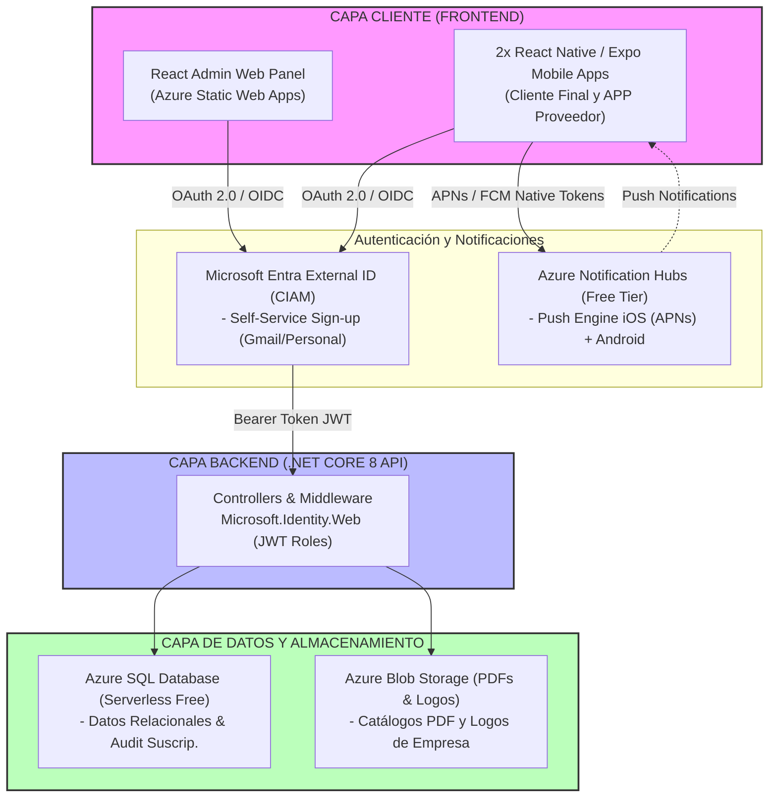

# DistroYaApiBackend
DistroYaApiBackend

#Diagrama Componente

```mermaid
 graph TD
    subgraph Frontend ["CAPA CLIENTE (FRONTEND)"]
        ReactAdmin["React Admin Web Panel<br>(Azure Static Web Apps)"]
        ReactNative["2x React Native / Expo Mobile Apps<br>(Cliente Final y APP Proveedor)"]
    end

    subgraph Auth_Notif ["Autenticación y Notificaciones"]
        CIAM["Microsoft Entra External ID (CIAM)<br>- Self-Service Sign-up (Gmail/Personal)"]
        NotificationHub["Azure Notification Hubs (Free Tier)<br>- Push Engine iOS (APNs) + Android"]
    end

    subgraph Backend ["CAPA BACKEND (.NET CORE 8 API)"]
        API["Controllers & Middleware<br>Microsoft.Identity.Web (JWT Roles)"]
    end

    subgraph Storage ["CAPA DE DATOS Y ALMACENAMIENTO"]
        AzureSQL["Azure SQL Database (Serverless Free)<br>- Datos Relacionales & Audit Suscrip."]
        AzureBlob["Azure Blob Storage (PDFs & Logos)<br>- Catálogos PDF y Logos de Empresa"]
    end

    %% Conexiones
    ReactAdmin -->|OAuth 2.0 / OIDC| CIAM
    ReactNative -->|OAuth 2.0 / OIDC| CIAM
    ReactNative -->|APNs / FCM Native Tokens| NotificationHub
    
    CIAM -->|Bearer Token JWT| API
    NotificationHub -.->|Push Notifications| ReactNative

    API --> AzureSQL
    API --> AzureBlob

    %% Estilos opcionales
    style Frontend fill:#f9f,stroke:#333,stroke-width:2px
    style Backend fill:#bbf,stroke:#333,stroke-width:2px
    style Storage fill:#bfb,stroke:#333,stroke-width:2px
```
